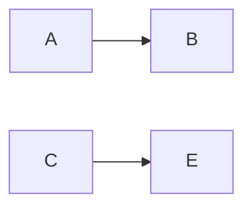

# How to install and use mermaid-mode in Doom
## Installation
1. Install mermaid-cli (mmdc) binary from the mermaid-cli
project if you plan to compile graphs in Emacs [mermaid-cli](https://github.com/mermaid-js/mermaid-cli)
2. Install from Melpa or load the mermaid-mode.el file. Use packages.el
```elisp
(package! mermaid-mode)
```
3. doom sync
## Usage
1. Create file like example.mmd with contents:

2. M+x mermaid-compile

By default mermaid output will be in *.png* format. To change output to *.svg*
By default mmdc will compile to png format. You can change that by setting the variable *mermaid-output-format*
